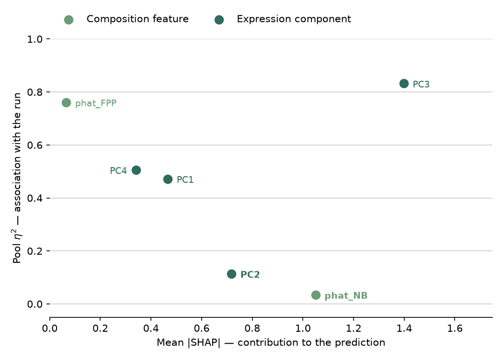
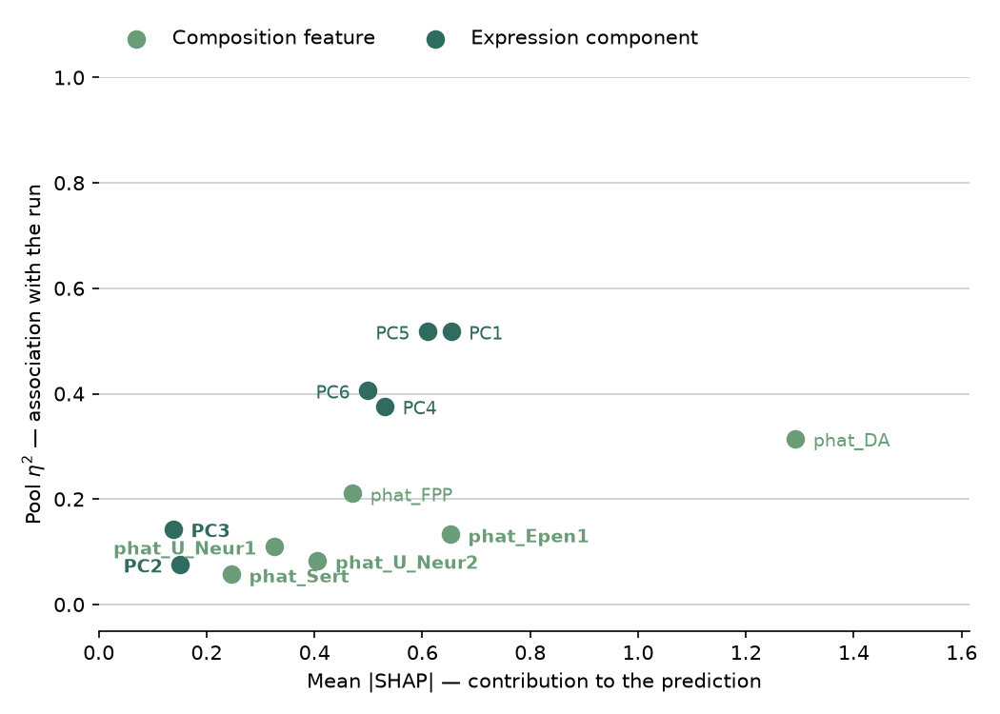

# Findings

**Predicting day-52 dopaminergic neuron yield from earlier single-cell
snapshots**, across 136 iPSC lines.

Practical question: partway through a midbrain differentiation, can you tell
whether it will produce dopaminergic neurons — early enough to act on it?

We set out to learn four things:

1. Could we build a predictive model?
2. Which features were most informative, and to what extent were they
   associated with technical covariates?
3. To what extent were predictions about cell-line differentiation efficiency
   affected by the donor?
4. How do these findings compare with what is currently known in the field?

Data: [Jerber et al. 2021](https://www.nature.com/articles/s41588-021-00801-6)
— scRNA-seq of iPSC lines differentiated toward midbrain dopaminergic fate,
multiplexed into pools, sampled at D11, D30 and D52.

| | day 11 — predictor | day 30 — predictor | day 52 — outcome |
|---|---|---|---|
| what is there | floor-plate progenitors, neuroblasts; **no DA cells yet** | 7 cell types; DA neurons have appeared | the dopaminergic fraction being predicted |
| result | ROC-AUC **0.906** | ROC-AUC 0.945 | median 0.165, range 0.010–0.742 |
| reading | a forecast, 41 days out | higher, but largely definitional | — |

136 lines · 157 `(line, pool)` combinations · 20 donors · 10 differentiation
pools. Donor-grouped 5-fold × 10 repeats, nested tuning, PCA refit per fold.
Methods in [`modeling/README.md`](modeling/README.md); output files in
[`modeling/results/README.md`](modeling/results/README.md).

> **How findings are stated below.** A **bolded line gives what was measured**,
> with its number. An indented `→` line gives what it may mean. The two are
> never fused into one sentence, because the measurement is evidence and the
> reading of it is not.

---

## 1. What is being predicted, and why not the published metric

The published metric is `(DA + Sert) / all D52 cells`. This project scores
**`DA / all D52 cells`, untreated cells only** — a deliberate divergence, not a
bug fix. It changes what every number here means, so it comes first.

1. **The published metric counts rotenone-treated cells.** D52 alone holds
   219,238 `ROT` against 303,856 `NONE`, interleaved through every qualifying
   combination. Rotenone inhibits mitochondrial complex I and preferentially
   damages dopaminergic neurons — the cells in its own numerator
   [[3]](#references). Verified against the authors' notebook: it applies a
   ≥10-cell threshold and no treatment filter anywhere.
2. **It sums two lineages that behave differently here.** At D30, `phat_DA`
   predicts the D52 dopaminergic fraction at ρ **+0.932**; `phat_Sert` predicts
   the same outcome at Pearson **+0.057**. Dopaminergic and serotonergic neurons
   arising from distinct rostro-caudal domains of the floor plate is established
   developmental biology [[4]](#references), not a finding here — but summing
   them presumes they behave as one quantity for scoring efficiency, and in this
   cohort they do not.

- **Cohort cost:** dropping treated cells puts 2 lines below the ≥10-cell
  threshold, giving **136 lines / 157 combinations / 20 donors** against the
  earlier phase's 138. The donor count is unchanged, so donor-grouped CV keeps
  its structure.
- **The two outcome families are not comparable and must never be differenced.**
  `DA+Sert` is bimodal with a real gap at 0.2; `DA/all` is unimodal with none,
  so the same threshold does a different job. A lower number here is a harder
  target, not a regression. The bridge to the published definition is
  [Appendix C](#appendix-c--phase-1-the-authors-dasert-outcome).

Success is defined as `DA/all` ≥ 0.2, giving **61 success / 75 failure**.

## 2. Can we build a predictive model?

**Yes — and at day 11 that is a forecast, 41 days ahead of the readout.**

Configuration is chosen by **flat CV + one-SE**: the simplest configuration
within one standard error of the grid's best, on donor-grouped folds.

*Selected configuration per task · donor-grouped, 10 repeats*

| Model | Configuration | Features | Nested | Flat |
|---|---|---|---|---|
| D11 classification | `logistic_l2`, C = 1.0, k = 4 | `phat_FPP`, `phat_NB` + PC1–PC4 | **0.906** | 0.918 |
| D11 regression | `ridge`, α = 10.0, k = 7 | same 2 proportions + PC1–PC7 | **0.503** | 0.506 |
| D30 classification | `logistic_l2`, C = 1.0, k = 6 | 6 proportions + PC1–PC6 | **0.945** | 0.956 |
| D30 regression | `ridge`, α = 10.0, **k = 0** | 6 proportions, **no PCs** | **0.802** | 0.812 |

- Classification is ROC-AUC, regression R². SD across the 10 repeats: 0.008,
  0.015, 0.008, 0.009 — in table order.
- `phat_P_FPP` is the reference proportion and never enters a fit. Hence two
  proportions at D11, six at D30.
- Hyperparameters come from nested inner folds that never see the test lines,
  and every PCA is refit per fold on training lines only.

**Why both numbers are shown.** Flat CV is the *selection criterion* — the
configuration was picked on those folds, so its score there is optimistic.
Nested CV is the out-of-fold estimate. The gap is small, 0.003 to 0.012, but
**positive in all four cases**, which is what selection bias looks like and what
noise does not.

**What nested CV estimates.** The selection *procedure*, not one fixed
configuration: each outer fold re-runs the tuning and may land on a different
`k`. The figure describes running this whole pipeline on new data.

### One limit on the day-30 model, stated here rather than buried

**At day 30 a single raw cell-type proportion ranks lines better than the whole
model: `phat_DA` alone reaches ROC-AUC 0.956 against the model's 0.939, in 10 of
10 repeats.** The model wins on every probability metric instead — log loss
0.571 → 0.328 and Brier 0.190 → 0.093, both 10 of 10 repeats.

→ To *rank* lines, one number suffices. To decide whether any single line is
worth continuing, you need a calibrated probability, and that is what the model
adds. ROC-AUC alone could not settle the question — at 0.95 it is saturated and
speaks only to ordering.

## 3. How much did the donor affect predictions?

**Donor identity does not materially affect how well a line's efficiency is
predicted.** 134 of 136 lines share a donor with at least one other line
(20 donors, 6.8 lines per donor, largest 16), so this had to be checked
directly rather than assumed.

*Nested CV, `logistic_l2` / `ridge`, identical folds*

| | plain 5-fold | donor-grouped | leave-one-donor-out |
|---|---|---|---|
| D11 ROC-AUC | 0.902 | **0.906** | 0.908 |
| D30 ROC-AUC | 0.938 | **0.945** | 0.938 |
| D11 R² | 0.515 | **0.503** | 0.505 |
| D30 R² | 0.817 | **0.802** | 0.804 |

**Every gap is within about one standard deviation, and classification scores
*higher* under donor-grouping at both timepoints — the opposite direction from a
donor-leakage signature.** Regression gives up 0.011–0.015 R², the one place a
small donor effect is visible at all.

→ Performance is not explained by sibling lines from the same donor sitting on
both sides of a split. It does not follow that donor effects are absent, or that
the model would generalise beyond these 20 donors.

### Where the outcome's variance actually sits

Variance in D52 efficiency attributable to each grouping, each against a
2,000-draw permutation null (the null matters: η² rises with group count on its
own).

| grouping | η² | null median | p |
|---|---|---|---|
| differentiation pool (batch) | **0.427** | 0.053 | 0.0000 |
| donor | 0.273 | 0.136 | 0.0025 |
| donor, on the same `(line, pool)` rows | 0.234 | 0.119 | 0.0045 |
| cell line | 0.872 | 0.869 | 0.46 |

- **The run a line went through is associated with more outcome variance than
  the donor it came from** (0.427 vs 0.273); both exceed their nulls.
- **The cell-line row is not interpretable.** With 136 groups across 157 rows,
  η² is at its null (0.872 vs 0.869, p = 0.46) — line identity has too many
  degrees of freedom for this statistic to say anything.

### The same line, differentiated twice

21 lines appear in more than one pool, which gives a direct read on
reproducibility.

**Efficiency agreed only weakly across repeat differentiations: ρ = +0.217
(n = 21, p = 0.35), median absolute difference 0.103 against a cohort SD of
0.191, with 17 of 21 pairs differing by more than twice the binomial
counting-noise floor.**

→ Run-to-run variation is substantial relative to the between-line variation
being predicted. This bounds what any predictor built on one run can achieve,
and it is the most likely reason pool η² exceeds donor η² above. It is a small
sample and the correlation is not significantly different from zero, so it
bounds rather than quantifies.

*These numbers are printed by `modeling/donor_batch_variance.py`, which writes
no file; they are reproduced by running it from the repository root.*

## 4. Day 11 — which features predict, and what they suggest

No dopaminergic neurons exist at day 11; the three annotated types are
floor-plate progenitor, neuroblast and proliferating FPP. Nothing at this
timepoint is definitional.

*Horizontal: mean |SHAP|, how far the feature moves a prediction. Vertical: pool
η², the share of the feature's across-line variance that goes with which of the
ten differentiation runs the line went through. **Pool η² measures potential run
dependence** — not the fraction proven to be technical artefact, and not proof
that a low-η² feature will transfer. No threshold is drawn: η² runs continuously
from 0.035 to 0.832 and no value of it has been validated as a transfer test.*

### The most important feature is also the most run-associated

**`PC3` leads on both counts: the largest contribution of any feature
(mean |SHAP| 1.398, LOCO Δ +0.064, 4.7× `phat_NB`'s) and the highest run
association (pool η² 0.832).**

→ Both are true and neither cancels the other. The defensible statement is that
`PC3` materially improves prediction among held-out lines from these runs, while
whether it ports to a new run is unestablished.

**Its negative pole is a coherent biosynthetic / growth programme —
`PTMA RANBP1 SNRPB HSP90AA1 PA2G4 NASP TYMS PHGDH PSAT1` — ribosome biogenesis,
chaperones, nucleotide and serine synthesis, with S-phase genes at median rank
57 of 2000 (p = 8.1 × 10⁻⁸).**

→ A growth-rate axis is exactly what would differ between culture runs, which
makes η² = 0.832 unsurprising rather than mysterious. These loadings are
hypothesis-generating; they should not anchor a biological conclusion.

### `phat_NB` — the best-evidenced day-11 feature

**The neuroblast proportion carries the largest negative contribution of any
composition feature (mean |SHAP| 1.05, ρ −0.554, LOCO Δ +0.014) at pool
η² 0.035 — an order of magnitude below anything else that contributes.**

→ Suggests that lines already further along the neurogenic trajectory at day 11
go on to yield a smaller dopaminergic fraction at day 52. Its low run
association makes it the feature most likely to mean the same thing in someone
else's hands, which is why it is the best-evidenced result at this timepoint.

### `PC2` corroborates it from expression alone

**`PC2` (pool η² 0.114) has the strongest univariate correlation in the table,
ρ −0.626, and describes a neurogenesis axis:
`NEUROD1 NHLH1 ELAVL3 DLL3 STMN2 MLLT11 ONECUT2` against
`HES1 GPC3 FRZB BMP4 OTX2 CDH2`, with pan-neuronal genes at median rank 1958 of
2000 on the neurogenic pole (p = 7.1 × 10⁻⁷). Within a PCA basis it tracks the
annotated neuroblast fraction at ρ ≈ +0.8.**

→ `NEUROD1` and `DLL3` opposing `HES1` is the expected signature of Notch
lateral inhibition [[5]](#references). Because `PC2` is computed from genes
alone and never from cell-type calls, counting annotated neuroblasts and reading
a proneural programme are two independent measurements agreeing — which is what
makes premature neurogenesis the most trustworthy day-11 reading, more than
either number alone.

*Caveat on the slot: `PCn` is a position in a per-fold basis, not a fixed axis.
`PC2` and `PC3` are near-tied in variance and trade places between fits — the
+0.8 above is 0.81, 0.81, 0.78 and 0.70 in four donor-grouped folds and −0.58 in
the fifth. Do not compare PC indices across tables.*

### `PC1` — the line's overall gene-expression state

**`PC1` captures 5.4% of the variance across 2,000 highly variable genes and is
a cell-cycle axis: top loadings `HMGB2 PTTG1 NUSAP1 CENPF TOP2A MKI67`, G2/M
genes at median rank 1972 of 2000 (p = 3.0 × 10⁻²⁷) [[1,2]](#references), and it
tracks the proliferating progenitor fraction at +0.829.**

→ This is the one component whose gene content can be read with confidence: it
replicates across PCA fits at r = 0.9995 with 25 of 25 top genes shared, whereas
the lower components rotate. It summarises where a line sits on a
proliferation-versus-differentiation axis — and keeping a cycling progenitor
pool at day 11 is the good outcome, differentiating early is not, which is the
same story `phat_NB` tells.

→ Note that `PC1` is *not* the component carrying the prediction — `PC3` is.
Biological legibility and predictive importance are different properties, and
here they sit on different components.

## 5. Day 30 — which features predict, and what they suggest

By day 30 the annotation already includes dopaminergic cells, so part of the
outcome exists in the predictors. This is **construct overlap, not leakage**:
day 30 and day 52 are separate cells from separate harvests, day 30 precedes day
52, and no day-52 information enters the features. The defensible claim is *how
much of the day-52 phenotype is already established by day 30*.

*Same axes and scale as the day-11 figure, so the two are directly comparable.*

### `phat_DA` — the outcome, already partly visible

**The dopaminergic proportion dominates the model (mean |SHAP| 1.292, ρ +0.792)
at pool η² 0.315.** Fit-free, with no model and no fitted parameter, it reaches
ROC-AUC **0.960** [0.922–0.986] on a donor-level bootstrap.

→ Ranking is already solved at day 30 by counting one cell type. η² 0.315 is the
lowest of the day-30 proportions, but that is nearly ten times `phat_NB`'s —
least run-associated *among* these features is not the same as low.

### `phat_Epen1` — where the culture goes when it fails

**The ependymal-like proportion is the second-largest composition contributor
(mean |SHAP| 0.652) and is negatively associated with the outcome (ρ −0.614) at
pool η² 0.133.**

→ `Epen1` is a ciliated, choroid-plexus-like off-target fate that retains
`SOX2`/`HES1`/`VIM`, so it derives from the same neuroepithelium as the
on-target progenitors but on a divergent branch. Suggests that failing cultures
are not simply failing to mature — they are committing elsewhere. Markers
establish identity, not fate; showing that these cells could not have become
dopaminergic would need lineage tracing this cross-sectional data cannot do.

### `PC1` — the day-11 axis, inverted

**Day-30 `PC1` captures 9.8% of variance, nearly double day 11's, with
pan-neuronal genes leading (`MLLT11 TUBB2B STMN2 GAP43 MAPT`) and the cell cycle
at the opposite pole (G2/M median rank 432, p = 5.5 × 10⁻⁸). It is driven by
composition (R² 0.891) far more than by within-type cell state (R² 0.484), and
tracks the dopaminergic fraction at +0.846.**

→ It now measures neuronal maturation rather than proliferation. Because
composition explains it nearly twice as well as cell state, it is largely
re-reading the cell-type counts rather than adding an independent view of them.
It is not a dopaminergic-identity axis: the leading genes are canonical neuronal
ones, and midbrain/DA determinants are absent.

### Expression adds nothing beyond composition

**Grouped permutation Δ is 0.360 for the proportions against 0.018 for the best
PC — a twentyfold gap — and day-30 regression selects `k = 0`, no expression
component at all.**

→ The selection rule lands independently where the permutation importances
already pointed. The two low-η² day-30 components are legible but redundant:
`PC2` (η² 0.076) is a motile-cilia programme tracking `phat_Epen1` at +0.706,
and `PC3` (η² 0.143) is a cell-cycle axis tracking `phat_FPP` at +0.815. Once
the proportions are in the model, a component that restates them adds nothing —
they are redundant, not uninformative, which says the day-30 annotation captures
the same structure the transcriptome shows.

### What is left undecided at day 30

**About 31% of day-30 cells are still uncommitted progenitors (`SOX2`⁺/`HES1`⁺/
VIM-high floor-plate progenitors), against ~48% already arrived and ~20%
off-target terminal fates. Scoring lines on those undecided cells alone — their
share of the non-target cells, which discards how many neurons a line has
already made — predicts the outcome at ROC-AUC 0.727 (ρ +0.452).**

→ Better than chance, far worse than counting the neurons. By day 30 most of the
answer is in what a line has already become, not in what is left to decide.

## 6. Comparison with Jerber et al. and the field

**The baseline is worth restating: Jerber et al. predicted differentiation
efficiency from *iPSC-stage bulk RNA-seq*, before differentiation began.**
Nothing here reproduces that. These are different predictors, a different
outcome, and in one case a different timepoint.

**Scope limit.** "New" below means *not present in the authors' analysis that we
read* — their `Figure_2` notebook and the outcome definition it encodes. We did
not audit the full paper or its supplements. Read "new" as "not found where we
looked", not as a priority claim.

| # | Finding | Status | Basis |
|---|---|---|---|
| 1 | D11 scRNA-seq predicts D52 **dopaminergic** yield: ROC-AUC 0.906, R² 0.503 | **New** | The authors predicted from iPSC-stage bulk, and their efficiency metric sums DA with Sert; a DA-only D11 → D52 predictor is not part of their analysis |
| 2 | D30 → D52 dopaminergic yield: ROC-AUC 0.945, R² 0.802 | **New, but largely definitional** | No D30 → D52 predictor in their work. The strength is mostly construct overlap — D30 already contains DA cells — not predictive discovery |
| 3 | **DA and Sert track independently**: D30 DA → D52 DA ρ = +0.932, D30 Sert → D52 DA Pearson **+0.057** | **New; it undercuts the combined metric** | Their `diff_efficiency` sums the two, presuming they behave as one quantity. They do not: `DA/(DA+Sert)` spreads near-uniformly 0–1 across lines, consistent with a line-intrinsic rostro-caudal identity fixed before D30 [[4]](#references) |
| 4 | `phat_NB` is D11's best-evidenced composition feature (pool η² 0.035) | **Recapitulates the authors' indirect observation** | They noted a poor-differentiation cluster correlating with D11 neuroblast proportion. Here it is a direct predictor, with the same sign under a different outcome |
| 5 | **At D30 the transcriptome adds nothing beyond cell-type composition** — 3 of 4 models select k = 0 PCs; permutation Δ 0.360 vs 0.018 | **New** | Not addressed by the authors, who did not build D30 predictors |

Two further points of contact with the field. The floor-plate-based midbrain
dopaminergic protocols this differentiation descends from
[[6,7]](#references) are efficient but variable between lines and runs, which is
the variation being predicted here. And the day-30 dopaminergic cells are
immature — `SLC6A3` (DAT) is absent — so the label counts an annotation, not
transporter-positive mature neurons [[8]](#references).

## 7. Conclusions

- **Could we build a predictive model? Yes.** Day 11 gives ROC-AUC 0.906 ± 0.008
  and R² 0.503 with no dopaminergic cells yet present — a genuine 41-day
  forecast. Day 30 gives 0.945 and 0.802, but mostly because the outcome is
  already partly visible in the predictors.
- **Which features, and how technical are they?** At day 11 the strongest
  contributor, `PC3`, is also the most run-associated (η² 0.832), while the
  best-evidenced feature is the neuroblast proportion (η² 0.035) — more
  neuroblasts at day 11, fewer dopaminergic neurons at day 52, corroborated
  independently by a proneural expression axis. At day 30 composition carries
  everything and expression adds nothing (permutation Δ 0.360 vs 0.018).
- **How much did the donor matter? Not much, for prediction.** Donor-grouped and
  plain CV differ by ≤0.007 ROC-AUC, with classification scoring *higher* under
  donor grouping. Donor explains 27% of outcome variance against the
  differentiation run's 43%, and the same line differentiated twice agrees only
  weakly (ρ +0.217, n = 21).
- **How does it compare with the field?** The authors predicted from iPSC-stage
  bulk RNA-seq, so none of this reproduces their result. The day-11 DA-only
  predictor, the day-30 analysis, and the independence of the dopaminergic and
  serotonergic fractions are not present in the analysis we read; the neuroblast
  association recapitulates an observation they made indirectly.

## References

1. **Tirosh I, Izar B, Prakadan SM, et al.** (2016) Dissecting the multicellular
   ecosystem of metastatic melanoma by single-cell RNA-seq. *Science*
   352(6282):189–196. <https://www.science.org/doi/10.1126/science.aad0501> —
   origin of the G1/S and G2/M gene sets used for the enrichment statistics here.
2. **Whitfield ML, Sherlock G, Saldanha AJ, et al.** (2002) Identification of
   genes periodically expressed in the human cell cycle and their expression in
   tumors. *Molecular Biology of the Cell* 13(6):1977–2000.
   doi:10.1091/mbc.02-02-0030 — the human cell-cycle periodicity map behind the
   G2/M identity of `TOP2A`, `CCNB1`, `PLK1`, `CENPF` and others named above.
   The Seurat `cc.genes` reference (<https://satijalab.org/seurat/reference/cc.genes>)
   supplies the exact lists matched against.
3. **Betarbet R, Sherer TB, MacKenzie G, et al.** (2000) Chronic systemic
   pesticide exposure reproduces features of Parkinson's disease. *Nature
   Neuroscience* 3:1301–1306 — rotenone as a complex I inhibitor with
   preferential toxicity to dopaminergic neurons.
4. **Ye W, Shimamura K, Rubenstein JLR, Hynes MA, Rosenthal A** (1998) FGF and
   Shh signals control dopaminergic and serotonergic cell fate in the anterior
   neural plate. *Cell* 93(5):755–766 — dopaminergic and serotonergic fates as
   distinct rostro-caudal outcomes of the same floor-plate signalling.
5. **Kageyama R, Ohtsuka T, Kobayashi T** (2007) The Hes gene family:
   repressors and oscillators that orchestrate embryogenesis. *Development*
   134:1243–1251 — `HES1` against proneural factors as Notch-mediated lateral
   inhibition.
6. **Chambers SM, Fasano CA, Papapetrou EP, Tomishima M, Sadelain M, Studer L**
   (2009) Highly efficient neural conversion of human ES and iPS cells by dual
   inhibition of SMAD signaling. *Nature Biotechnology* 27:275–280.
7. **Kriks S, Shim J-W, Piao J, et al.** (2011) Dopamine neurons derived from
   human ES cells efficiently engraft in animal models of Parkinson's disease.
   *Nature* 480:547–551 — the floor-plate-based midbrain dopaminergic
   differentiation strategy this protocol family descends from.
8. **La Manno G, Gyllborg D, Codeluppi S, et al.** (2016) Molecular diversity of
   midbrain development in mouse, human, and stem cells. *Cell* 167(2):566–580 —
   reference for midbrain dopaminergic identity and maturation markers.
9. **Luecken MD, Theis FJ** (2019) Current best practices in single-cell RNA-seq
   analysis: a tutorial. *Molecular Systems Biology* 15(6):e8746.
   <https://doi.org/10.15252/msb.20188746> — why ribosomal, mitochondrial and
   cell-cycle signal are treated as technical confounders here.
10. **Jerber J, Seaton DD, Cuomo ASE, et al.** (2021) Population-scale
    single-cell RNA-seq profiling across dopaminergic neuron differentiation.
    *Nature Genetics* 53:304–312 — source of the data, the D11/D30/D52 design,
    the cell-type labels and the 0.2 efficiency threshold.

Data: [E-MTAB-10018](https://www.ebi.ac.uk/biostudies/arrayexpress/studies/E-MTAB-10018).
The authors' analysis code:
[`singlecell_neuroseq_paper`](https://github.com/single-cell-genetics/singlecell_neuroseq_paper),
specifically `plotting_notebooks/Figure_2/fig2b_and_heatmap_extended.ipynb`,
which is the notebook the outcome comparison in §1 is checked against.

*References 1, 2, 9 and 10 were already used in
[`modeling/docs/PCA_interpretation.md`](modeling/docs/PCA_interpretation.md).
References 3–8 are added here for claims the analysis relies on but does not
itself establish.*

---

## Appendix A — Full performance tables

Every fitted model, every CV scheme, nested tuning throughout. Both timepoints
were scored on fold tables verified to agree on every fold's train/test
membership, so the D11-vs-D30 comparison is paired.

*D11 → D52 · classification*

| Model | Scheme | ROC-AUC | PR-AUC | Bal. acc | Sens. | Spec. | F1 | Brier |
|---|---|---|---|---|---|---|---|---|
| `logistic_l2` | plain | 0.902 ± 0.010 | 0.864 ± 0.010 | 0.837 ± 0.015 | 0.856 ± 0.034 | 0.817 ± 0.019 | 0.822 ± 0.017 | 0.129 ± 0.007 |
| `logistic_l2` | donor_grouped | 0.906 ± 0.008 | 0.874 ± 0.012 | 0.834 ± 0.021 | 0.864 ± 0.031 | 0.804 ± 0.026 | 0.821 ± 0.022 | 0.125 ± 0.006 |
| `logistic_l2` | loco | 0.912 ★ | 0.883 | 0.861 ★ | 0.869 | 0.853 ★ | 0.848 ★ | 0.121 ★ |
| `logistic_l2` | lodo | 0.908 | 0.886 | 0.820 | 0.852 | 0.787 | 0.806 | 0.126 |
| `logistic_l1` | plain | 0.908 ± 0.016 | 0.873 ± 0.018 | 0.839 ± 0.025 | 0.844 ± 0.034 | 0.833 ± 0.022 | 0.824 ± 0.027 | 0.123 ± 0.012 |
| `logistic_l1` | donor_grouped | 0.905 ± 0.011 | 0.872 ± 0.012 | 0.837 ± 0.016 | 0.872 ± 0.017 ★ | 0.803 ± 0.025 | 0.825 ± 0.016 | 0.126 ± 0.009 |
| `logistic_l1` | loco | 0.907 | 0.877 | 0.861 ★ | 0.869 | 0.853 ★ | 0.848 ★ | 0.123 |
| `logistic_l1` | lodo | 0.906 | 0.886 ★ | 0.821 | 0.869 | 0.773 | 0.809 | 0.126 |
| trivial baseline | — | 0.500 | 0.449 | 0.500 | 1.000 | 0.000 | 0.619 | 0.247 |

*D30 → D52 · classification*

| Model | Scheme | ROC-AUC | PR-AUC | Bal. acc | Sens. | Spec. | F1 | Brier |
|---|---|---|---|---|---|---|---|---|
| `logistic_l2` | plain | 0.938 ± 0.015 | 0.910 ± 0.020 | 0.884 ± 0.012 | 0.885 ± 0.020 | 0.883 ± 0.016 | 0.872 ± 0.013 | 0.092 ± 0.007 |
| `logistic_l2` | donor_grouped | 0.945 ± 0.008 | 0.906 ± 0.019 | 0.877 ± 0.013 | 0.880 ± 0.022 | 0.875 ± 0.009 | 0.865 ± 0.015 | 0.090 ± 0.006 |
| `logistic_l2` | loco | 0.945 ★ | 0.886 | 0.876 | 0.885 | 0.867 | 0.864 | 0.087 ★ |
| `logistic_l2` | lodo | 0.938 | 0.878 | 0.884 ★ | 0.902 ★ | 0.867 | 0.873 ★ | 0.090 |
| `logistic_l1` | plain | 0.934 ± 0.014 | 0.908 ± 0.022 | 0.881 ± 0.011 | 0.872 ± 0.020 | 0.891 ± 0.014 ★ | 0.869 ± 0.013 | 0.094 ± 0.008 |
| `logistic_l1` | donor_grouped | 0.940 ± 0.009 | 0.899 ± 0.023 | 0.870 ± 0.013 | 0.861 ± 0.018 | 0.879 ± 0.015 | 0.856 ± 0.014 | 0.093 ± 0.005 |
| `logistic_l1` | loco | 0.943 | 0.914 ★ | 0.883 | 0.885 | 0.880 | 0.871 | 0.090 |
| `logistic_l1` | lodo | 0.939 | 0.873 | 0.876 | 0.885 | 0.867 | 0.864 | 0.091 |
| trivial baseline | — | 0.500 | 0.449 | 0.500 | 1.000 | 0.000 | 0.619 | 0.247 |

*D11 → D52 · regression*

| Model | Scheme | R² | MAE | RMSE | Out-of-range |
|---|---|---|---|---|---|
| `ridge` | plain | 0.515 ± 0.018 ★ | 0.100 ± 0.002 | 0.133 ± 0.002 ★ | 0.056 ± 0.010 |
| `ridge` | donor_grouped | 0.503 ± 0.015 | 0.099 ± 0.001 | 0.134 ± 0.002 | 0.057 ± 0.008 |
| `ridge` | loco | 0.501 | 0.100 | 0.134 | 0.066 |
| `ridge` | lodo | 0.505 | 0.099 ★ | 0.134 | 0.051 |
| `lasso` | plain | 0.514 ± 0.015 | 0.100 ± 0.002 | 0.133 ± 0.002 | 0.050 ± 0.019 ★ |
| `lasso` | donor_grouped | 0.502 ± 0.023 | 0.100 ± 0.001 | 0.134 ± 0.003 | 0.051 ± 0.011 |
| `lasso` | loco | 0.507 | 0.099 | 0.134 | 0.066 |
| `lasso` | lodo | 0.513 | 0.099 | 0.133 | 0.066 |
| trivial baseline | — | 0.000 | 0.158 | 0.190 | 0.000 |

*D30 → D52 · regression*

| Model | Scheme | R² | MAE | RMSE | Out-of-range |
|---|---|---|---|---|---|
| `ridge` | plain | 0.817 ± 0.014 | 0.059 ± 0.002 | 0.081 ± 0.003 | 0.037 ± 0.010 |
| `ridge` | donor_grouped | 0.802 ± 0.009 | 0.061 ± 0.001 | 0.085 ± 0.002 | 0.037 ± 0.006 |
| `ridge` | loco | 0.820 | 0.058 | 0.081 | 0.044 |
| `ridge` | lodo | 0.804 | 0.060 | 0.084 | 0.051 |
| `lasso` | plain | 0.828 ± 0.005 ★ | 0.056 ± 0.001 ★ | 0.079 ± 0.001 ★ | 0.004 ± 0.005 ★ |
| `lasso` | donor_grouped | 0.811 ± 0.006 | 0.058 ± 0.001 | 0.083 ± 0.001 | 0.010 ± 0.009 |
| `lasso` | loco | 0.821 | 0.058 | 0.081 | 0.029 |
| `lasso` | lodo | 0.819 | 0.058 | 0.081 | 0.015 |
| trivial baseline | — | 0.000 | 0.158 | 0.190 | 0.000 |

★ marks the best value per column. No row is privileged: the configuration named
in §2 is not necessarily the best cell in any column here. `loco` and `lodo` are
single repeats by construction and carry no SD. Sensitivity 1.000 and F1 0.619
come free from always predicting "success", which is why neither is quoted alone.

---

## Appendix B — Feature importance in detail

*Every day-30 feature · `logistic_l2`*

| Feature | Mean \|SHAP\| | ρ | LOCO Δ | Pool η² |
|---|---|---|---|---|
| `phat_DA` | 1.292 | +0.792 | −0.002 | 0.315 |
| `PC1` | 0.653 | +0.680 | +0.001 | 0.518 |
| `phat_Epen1` | 0.652 | −0.614 | +0.000 | 0.133 |
| `PC5` | 0.610 | +0.557 | +0.002 | 0.518 |
| `PC4` | 0.530 | +0.182 | +0.001 | 0.376 |
| `PC6` | 0.499 | −0.201 | +0.002 | 0.406 |
| `phat_FPP` | 0.470 | −0.580 | −0.001 | 0.211 |
| `phat_U_Neur2` | 0.406 | −0.309 | +0.000 | 0.083 |
| `phat_U_Neur1` | 0.325 | −0.454 | −0.002 | 0.110 |
| `phat_Sert` | 0.246 | +0.214 | −0.001 | 0.057 |
| `PC2` | 0.151 | −0.213 | −0.001 | 0.076 |
| `PC3` | 0.138 | −0.301 | −0.001 | 0.143 |
| `phat_P_FPP` (reference) | — | −0.482 | +0.006 | 0.140 |

*The ρ column is computed on the fold-averaged model features, which is why
`phat_DA` reads +0.792 here and +0.932 in the fit-free benchmark below — the
latter uses the raw line-level proportion. Same association, two aggregations.*

**All day-30 LOCO Δ are ≈ 0.** With six correlated proportions plus six PCs,
dropping any single feature costs nothing measurable — no individual feature is
*necessary*, which is why the grouped permutation Δ (0.360 for all proportions
together) is the informative statistic at day 30, not the per-feature column.

*The two timepoints side by side*

| | Day 11 | Day 30 |
|---|---|---|
| Least run-associated contributing feature | `phat_NB`, η² 0.035 | `phat_DA`, η² 0.315 |
| Largest contributor | `PC3` (\|SHAP\| 1.398, η² 0.832) | `phat_DA` (\|SHAP\| 1.292, η² 0.315) |
| A low-η² PC that also predicts? | yes — `PC2` (η² 0.114, ρ −0.626) | no |
| PCs in the selected model | 4 of 10 | 3 of 4 families select zero |
| Composition vs expression | comparable | 0.360 vs 0.018 — 20× |

The contrast is real but should not be over-read. Expression adds something at
day 11 and little at day 30, which follows from day 30's annotation already
containing the outcome's numerator. It does **not** say day 11's expression
features would survive a new run — that remains untested at both timepoints.

*"Run-associated" throughout, never "contaminated": a high η² shows a feature
varies with the differentiation run, which is not the same as showing it is a
technical artefact.*

**Fit-free reference lines at day 30**, donor-level bootstrap over 20 donors,
2,000 resamples. In-sample, so not like-for-like with the cross-validated models
above.

| Benchmark (no model, no fitted parameter) | ρ | ROC-AUC |
|---|---|---|
| **`phat_DA` alone** | +0.932 | **0.960** [0.922–0.986] |
| `phat_DA + phat_Sert` | +0.799 | 0.886 [0.834–0.941] |
| `phat_FPP + phat_P_FPP` (undecided) | −0.788 | 0.883 [0.826–0.941] |
| progenitor balance (share of non-target) | +0.452 | 0.727 [0.660–0.794] |

**A mis-specified benchmark nearly hid this result.** The comparator was carried
over from the previous outcome and summed `phat_DA + phat_Sert` (0.886) rather
than `phat_DA` (0.960). Against the wrong reference the model appeared to add
~6 AUC points. A benchmark whose numerator does not match the outcome is not a
weaker check — it is a misleading one. This applies to day 30 only: day 11 has
no `phat_DA`, so there is no analogous single-column comparator there.

**One caution on reading coefficients.** `phat_Sert` has univariate ρ **+0.215**
but a fitted coefficient of **−0.288** — positive alone, negative once the other
types are held fixed. A conditional coefficient is not a simple biological
effect.

---

## Appendix C — Phase 1: the authors' DA+Sert outcome

The bridge to the published result. Phase 1 reproduced Jerber et al.'s own
definition — `(DA+Sert) / all D52 cells`, **all** cells including
rotenone-treated, **138** lines, D11 only.

| Phase 1, donor-grouped, nested | value |
|---|---|
| `logistic_l2` ROC-AUC | **0.947 ± 0.007** |
| `ridge` R² | **0.653 ± 0.021** |
| cohort | 138 lines, 96 success / 42 failure at the 0.2 threshold |
| LOCO / LODO agreement | ROC-AUC 0.942 / R² 0.682 |

> **Not comparable to the results above**, for the reasons in
> [§1](#1-what-is-being-predicted-and-why-not-the-published-metric). A lower
> number in the main analysis is a harder target, not a regression.

Full phase-1 tables and its own literature assessment are preserved in git
history at commit `9a23404`; the artifacts it produced are unchanged on disk
(`modeling/results/results_{regression,classification}.csv`).
